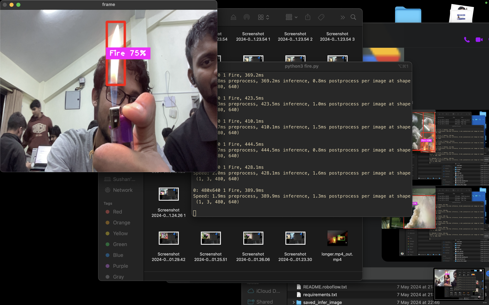

Agni Netra

## Synopsis

Our project `Agni-Netra` is driven by the urgent need to address the ecological, environmental, and economic impacts of forest fires, particularly in Nepal where these incidents often wreak havoc with devastating consequences. Despite commendable efforts in forest restoration, the months of March and April pose significant threats to our progress due to the rampant occurrence of uncontrolled fires. Shockingly, in 2021 alone, Nepal recorded a staggering 6279 forest fires, as reported by the Nepal Economic Forum.

Compounding this issue, Nepal ranks 10th globally in the 2021 Long-Term Climate Risk Index, underscoring the escalating danger posed by forest fires exacerbated by increasingly hot and dry conditions.

To combat this pressing challenge, we propose the development of a portable forest fire detection device. In essence, it comprises a sophisticated computer vision model designed to swiftly detect forest fires, complemented by a hardware-accelerated feedback system. This system operates as follows:

- Real-time Fire Detection: Utilizing cameras, our system employs real-time inference to swiftly identify the presence of forest fires, enhancing response times and minimizing damage.
- Alert Mechanism: Upon detecting a fire, the device promptly sends crucial information including GPS coordinates and images of the fire to forest rangers or relevant authorities. This rapid dissemination of data enables swift and targeted intervention, potentially mitigating the severity of the fire.

By deploying this innovative solution, we aim to significantly enhance our capacity to detect and respond to forest fires, ultimately safeguarding our precious natural resources and communities from the devastating impacts of these destructive events.

## AI Tools Details

- finalmodel.pt pytorch model fine tuned with yolov8n architecture.
- Uses OpenCV for boundary box display in real time video

## Hardware Details

- Uses SBC like Raspberry PI for real time forest detection
- PI detects and sends a HTTP GET request to ESP32 Microcontroller with Image link and Number as parameter
- ESP32 sends AT commands to A9G Pudding which then gets the GPS data and then sends the message to the number with image and coordinates

## Steps for running the Fire inference Model

- `pip3 install -r requirements.txt`
- `python3 AgniNetra.py`

## Steps For Hardware

<center>
    
</center>

- The components should be connected according to schematics
- Before uploading the code on `hardware/hardware.ino` change the following line to your SSID and password

```c
const char* Sim800Lid = "Your SSID";
const char* paSim800Lword = "Your Password";
```

## Screenshots




